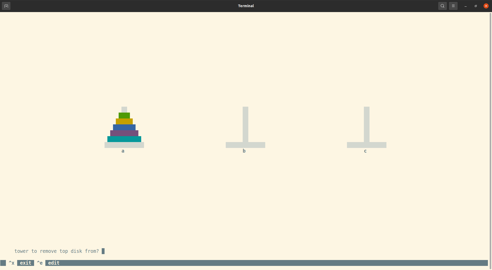
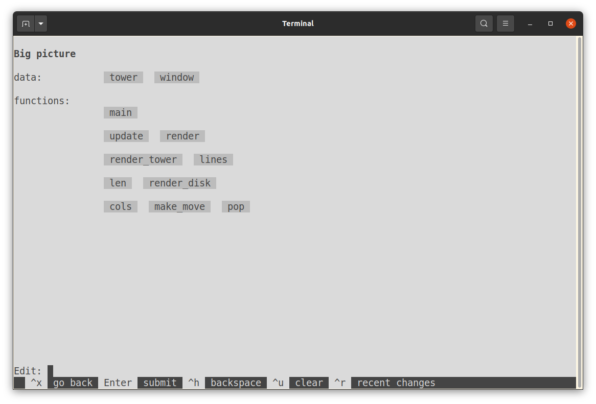

# Teliva - an environment for end-user programming

> &ldquo;Enable all people to modify the software they use in the course of using it.&rdquo;
> &mdash; https://futureofcoding.org/episodes/033.html

> &ldquo;What if we, and all computer users, could reach in and modify our favorite apps?&rdquo;
> &mdash; https://www.inkandswitch.com/end-user-programming

> &ldquo;Software must be as easy to change as it is to use.&rdquo;
> &mdash; https://malleable.systems

## What's this, then?

Teliva is the most naive way to make software as easy to change as it is to
use: an interpreted environment for running shareable little text-mode apps.
Its language of choice is Lua, excluding all features that can conceivably
introduce moving parts in running a Lua program.

Here's how you run one of the example apps (the [Tower of Hanoi](https://en.wikipedia.org/wiki/Tower_of_Hanoi)):

```sh
git clone https://github.com/akkartik/teliva
cd teliva
make linux  # replace with 'macosx', etc. depending on your OS
src/teliva hanoi.tlv
```



No matter what app you run, you are always guaranteed access to a single
obvious, consistent way (currently the hotkey `ctrl-u`) to inspect its
sources.

When you look under the hood of an app, the first thing you see is a
_big-picture view_ which shows the app's major data structures and a top-down
view of the app's code.



Select a definition, make a change, hit `ctrl-x`, and the app will run with
your updates. ([video](https://archive.org/details/akkartik-2021-11-14))

You will need some Unix-like platform with a C compiler and the ncurses and
openssl libraries. Some possible commands to install them, depending on your
OS and package manager of choice:

* `guix shell -D lua openssl -- make linux`
* `nix-shell --pure` (from a directory containing shell.nix in this repo)
* `sudo apt install libncursesw6-dev openssl`
* `brew install ncurses openssl`

So far I've tested Teliva on Linux, Mac OS X, OpenBSD, NetBSD and FreeBSD; it
should work on other flavors of BSD, WSL on Windows, etc. with only minor
modifications.

## What else can it do?

Anything! Some more sample apps to try out:

* Conway's Game of Life, as an example of an animated local app.
  ```
  src/teliva life.tlv
  ```

  [video](https://merveilles.town/@akkartik/107277755421024772)

* A viewer for [LiChess TV](https://lichess.org/tv), as an example of
  animation and accessing a remote API over a network.
  ```
  src/teliva chesstv.tlv
  ```

  [video](https://merveilles.town/@akkartik/107319684018301051)

* A browser for the [Gemini protocol](https://gemini.circumlunar.space).
  ```
  src/teliva gemini.tlv
  ```

  [video](https://merveilles.town/@akkartik/107489728557201145)

These are just a start. The sky is the limit.

## So, just a programming language, then?

There's one big difference with other programming languages: Teliva apps are
sandboxed like a browser. Most languages assume the fiction that the person
running a program trusts all the code in the program. This assumption hasn't
been valid since a decade after the Unix big bang, if then. Teliva takes on
the reality that apps can get complex and use code written by strangers. In
response, Teliva tries to always summarize for you what the program you're
running is trying to do, and to ask you before a random app tries to do
something sensitive. Permissions you grant a Teliva app will be _flexible_ and
_easy to understand_. Browsers and mobile apps today tend to make you choose
between those two properties.

The sandboxing experience is still under construction. See [this talk](https://archive.org/details/akkartik-2022-01-16-fosdem)
(15 minutes) for a rundown of current thinking. It isn't yet safe to run
untrusted Teliva apps you download from the internet. (Fortunately you're
unlikely to run into any such apps.)

## Isn't this just an IDE?

There's one big difference: these apps are not intended to be runnable outside
of the Teliva environment. Editing the sources and visualizing permissions
granted will always be core features that are front and center in the UI.

A second, more subtle difference: it's primarily an environment for _running_
apps, and only secondarily for editing them. Starting up the environment puts
you in a running app by default. Creating an app from a clean slate is a
low-priority use case, as is lots of specialized support for developing
complex apps. The sweet spot for Teliva is simple apps that people will want
to edit after using for a while.

## Who are we trusting by trusting you?

Teliva is designed to have a shallow, manageable software supply chain. I
rely on packages distributed by the following reputable brands:

* A well-known Posix OS, either Linux or BSD.
* A standard C library, usually GNU libc.
* The [ncurses](https://tldp.org/HOWTO/NCURSES-Programming-HOWTO) library for
  building text-mode user interfaces. ([Alternative documentation](https://tldp.org/LDP/lpg-0.4.pdf))

Teliva's codebase also includes forks of the following reputable brands:

* [Lua 5.1](https://www.lua.org/manual/5.1)
* The [Kilo](https://github.com/antirez/kilo) text editor, modified to use
  ncurses. (Read more about it in this [fantastic walk-through](https://viewsourcecode.org/snaptoken/kilo).)
* The [lcurses](https://github.com/lcurses/lcurses) binding for ncurses (as
  module `curses`).
* The [luasocket](https://w3.impa.br/~diego/software/luasocket) library of
  networking primitives (modules `socket`, `http`, `url`, `headers`, `mime`,
  `ltn12`).
* The [luasec](https://github.com/brunoos/luasec) library for HTTPS support
  (modules `https` and `ssl`).
* The [json.lua](https://github.com/rxi/json.lua) library for
  serializing/deserializing to JSON (modules `json` and `jsonf`).

I only add to this list with great deliberation. Since it includes indirect
suppliers (suppliers of suppliers), I have an incentive to only include
suppliers who also have shallow supply chains. Minimizing the size of the
supply chain should result in more reliable software that requires less
frequent upgrades.

(Look in [the manual](https://akkartik.github.io/teliva/doc/manual.html) for
more details of what's available.)

## Why Lua?

It's reputedly the fastest interpreted language per line of implementation
code.

## Will it run any Lua program?

Not quite. My priority is providing a good experience for newcomers to
comprehend and modify the programs they use. If it's not clear how to provide
that experience for some kinds of Lua programs, I'd rather disable support for
them in Teliva and let people use regular Lua. Or other platforms!

- This approach doesn't make sense for batch programs, I think. I also don't
  yet have a good story for building server programs in this way.

- I don't know how to obtain a simple, shallow graphics stack, so there's no
  support for graphics at the moment.

- Teliva initializes the ncurses library by default, so apps should assume
  they have access to a (color, UTF-8) text-mode window for printing text to,
  and a keyboard for reading keystrokes from.

- Teliva doesn't use files for source code, so the `require` keyword no longer
  makes sense. You get some libraries preloaded (see below). Beyond those,
  apps should include all Lua code they want to use.

- To create a well-behaved sandbox, Teliva doesn't support adding libraries
  with C bindings beyond the few it starts up with.

- Functions that start with `test_` are special. They're considered automated
  tests and called without arguments every time an app starts up.

- The function `main` is special. It runs every time an app starts up, if all
  its automated tests pass.

- Some functions are disabled because I don't know how to sandbox them
  effectively:
  - `os.execute`, `os.getenv`, `io.popen`
  - `io.lines` (not a security issue; just difficult to distinguish missing
    files from sandboxing issues)

- Some functions are disabled because they don't seem to make sense in an
  ncurses environment. This includes the Lua notions of default files, which
  start out as stdin/stdout.
  - `io.input`, `io.read`
  - `io.output`, `io.write`, `io.flush`
  - `curses.getstr()`, `curses.mvgetstr()` (When using these it's easy for the
    screen to get confusing.)

- Some functions in lcurses have [additional smarts](https://github.com/lcurses/lcurses/blob/master/lib/curses.lua).
  Teliva is [consistent with the underlying ncurses](https://github.com/akkartik/teliva/blob/main/src/lcurses/curses.lua).

Look in [the manual](https://akkartik.github.io/teliva/doc/manual.html) for
more details of what's available.

I may delete more capabilities throughout this stack as I discover features
that don't fit well with the Teliva experience. If you find Teliva of use,
please [introduce yourself](http://akkartik.name/contact) to me so that I am
aware of your use cases. Anybody who is interested can gain a say in its
future direction.

## What's with the name?

Teliva is the Tamil root for &lsquo;clear&rsquo;. Very much aspirational.

## Known issues

* Colors are currently hardcoded. You get a light background even if your
  terminal started out dark. To tweak colors, look for calls to
  `assume_default_colors()` and `init_pair()`, either in .tlv files for a
  specific app, or in the C sources for the standard code browser/editor.

* Backspace is known to not work in some configurations. As a workaround,
  typing `ctrl-h` tends to work in those situations.

* Keys outside the main keyboard area are mostly not supported. This includes
  the delete key when it's set away from the main keyboard area. (Macs call
  the backspace key &ldquo;delete&rdquo;; it should behave like backspace. As
  a consequence the menu sometimes mentions keys that don't work, just to
  encourage people to try options.)

* chesstv.tlv silently fails on OpenBSD and NetBSD for some reason I haven't
  investigated yet. Interestingly, I'm running Teliva with curses on NetBSD
  but ncurses on OpenBSD, so that is probably not an issue.

* life.tlv looks terrible on OpenBSD and NetBSD, with lines wrapping halfway.

## Mirrors and Forks

Updates to Teliva can be downloaded from the following mirrors:
* https://github.com/akkartik/teliva
* https://repo.or.cz/teliva.git
* https://codeberg.org/akkartik/teliva
* https://tildegit.org/akkartik/teliva
* https://git.tilde.institute/akkartik/teliva
* https://git.sr.ht/~akkartik/teliva
* https://pagure.io/teliva

Forks of Teliva are encouraged. If you show me your fork, I'll link to it
here.

## Feedback

[Most appreciated.](http://akkartik.name/contact)
