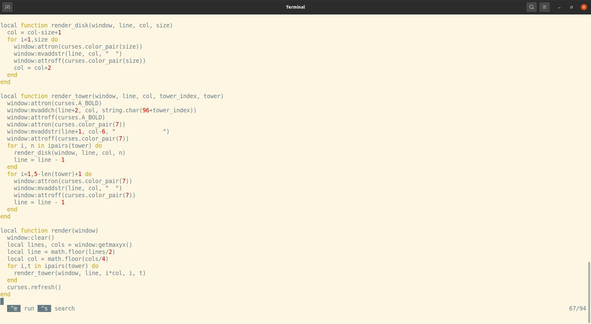

# Teliva - an environment for end-user programming

> &ldquo;Enable all people to modify the software they use in the course of using it.&rdquo;
> &mdash; https://futureofcoding.org/episodes/033.html

> &ldquo;What if we, and all computer users, could reach in and modify our favorite apps?&rdquo;
> &mdash; https://www.inkandswitch.com/end-user-programming

> &ldquo;Software must be as easy to change as it is to use.&rdquo;
> &mdash; https://malleable.systems

## What's this, then?

An extremely naïve, [brutalist](https://en.wikipedia.org/wiki/Brutalist_architecture)
attempt at packaging up simple Lua (5.1) apps with all the stuff needed to
edit and build them.

```
git clone https://github.com/akkartik/teliva
cd teliva
make linux
src/teliva hanoi.teliva
```

Here's an example app (the [Tower of Hanoi](https://en.wikipedia.org/wiki/Tower_of_Hanoi)):


No matter what app you run, you are always guaranteed access to a single
obvious, consistent way (currently the hotkey `ctrl-e`) to edit its sources.
And to run the updates after editing.



Toggle the same hotkey to restart the app with the new sources.

Over time I hope to improve the experience for error messages, failing tests,
undoing changes and so on. The emphasis will be on maximizing hackability
rather than functionality. I plan to be extremely parsimonious in taking on
further dependencies. It should need just a Linux (or maybe some other Unix?)
kernel, a C compiler, 12kLoC of Lua in this repo, maybe a couple more basic C
libraries.

## Isn't this just an IDE?

There's one big difference: these apps are not intended to be runnable outside
of the Teliva environment. Editing the sources will always be a core feature
that's front and center in the UI.

At the moment this isn't much of a restriction given how trivial the
differences with Lua are. You also don't get much benefit in exchange for
taking on this restriction. Let's see if that changes.

A second, more subtle difference: it's primarily an environment for _running_
apps, and only secondarily for editing them. Starting up the environment puts
you in a running app by default. Creating an app from a clean slate is a
low-priority use case, as is lots of specialized support for developing
complex apps. The sweet spot for Teliva is simple apps that people will want
to edit after using for a while.

## Why Lua?

It's reputedly the fastest interpreted language per line of implementation
code.

## Will it run any Lua program?

Not quite. My plan is to disable support for certain Lua libraries as I gain
experience programming in this way:

- This approach doesn't make sense for batch programs, I think.

- I don't know how to obtain a simple, shallow graphics stack, so there's no
  support for graphics at the moment.

- Teliva initializes the ncurses library by default, so apps should assume
  they have access to a text-mode window for printing text to, and a keyboard
  for reading unbuffered keystrokes from. Compare `hanoi.teliva` with
  `hanoi.lua` to get a sense for what changes are needed.

- I want to provide sandboxed access to system resources (file system,
  network, etc.) which will likely create incompatibilities with the standard
  library. I'm disinclined to try to &lsquo;improve&rsquo; on Lua syntax,
  however. It's not my favorite, but it's good enough.

Teliva is not tested much at all yet. This is my first time programming either
in Lua or within Lua. So bug reports are most appreciated if Lua programs
behave unexpectedly under Teliva.

## Will it run any ncurses program?

Hopefully. Ncurses is extremely portable; I don't test on all the
configurations ncurses supports. In particular, I assume terminals with colors
and UTF-8 support.

## Will it run any Lua [lcurses](https://github.com/lcurses/lcurses) program?

There will likely be some exceptions that I'll record here as I encounter them:

- lcurses has some strange &ldquo;smarts&rdquo; that result in
  `window:getch()` not behaving like the global `curses.getch()`. Teliva is
  consistent with the underlying ncurses.

## What's with the name?

Teliva is the Tamil root for &lsquo;clear&rsquo;. Very much aspirational.

## Credits

This repository is an unholy union of:
* The [Lua](https://www.lua.org) 5.1 programming language.
  ([Documentation](https://www.lua.org/pil/contents.html))
* The [ncurses](https://tldp.org/HOWTO/NCURSES-Programming-HOWTO) library for
  building text-mode user interfaces. ([Alternative documentation](https://tldp.org/LDP/lpg-0.4.pdf))
* The [Lcurses](https://github.com/lcurses/lcurses) library providing Lua
  bindings for ncurses. ([Documentation](http://lcurses.github.io/lcurses))
* The [Kilo](https://github.com/antirez/kilo) text editor. ([With a fantastic
  walk-through.](https://viewsourcecode.org/snaptoken/kilo))

Send all praise to them, brickbats to [me](http://akkartik.name/contact).

# README for Lua 5.1

* What is Lua?
  ------------
  Lua is a powerful, light-weight programming language designed for extending
  applications. Lua is also frequently used as a general-purpose, stand-alone
  language. Lua is free software.

  For complete information, visit Lua's web site at http://www.lua.org/ .
  For an executive summary, see http://www.lua.org/about.html .

  Lua has been used in many different projects around the world.
  For a short list, see http://www.lua.org/uses.html .

* Availability
  ------------
  Lua is freely available for both academic and commercial purposes.
  See COPYRIGHT and http://www.lua.org/license.html for details.
  Lua can be downloaded at http://www.lua.org/download.html .

* Installation
  ------------
  Lua is implemented in pure ANSI C, and compiles unmodified in all known
  platforms that have an ANSI C compiler. In most Unix-like platforms, simply
  do "make" with a suitable target. See INSTALL for detailed instructions.

* Origin
  ------
  Lua is developed at Lua.org, a laboratory of the Department of Computer
  Science of PUC-Rio (the Pontifical Catholic University of Rio de Janeiro
  in Brazil).
  For more information about the authors, see http://www.lua.org/authors.html .

# README for Kilo

Kilo is a small text editor in less than 1K lines of code (counted with cloc).

A screencast is available here: https://asciinema.org/a/90r2i9bq8po03nazhqtsifksb

Usage: kilo `<filename>`

Keys:

    CTRL-S: Save
    CTRL-Q: Quit
    CTRL-F: Find string in file (ESC to exit search, arrows to navigate)

Kilo does not depend on any library (not even curses). It uses fairly standard
VT100 (and similar terminals) escape sequences. The project is in alpha
stage and was written in just a few hours taking code from my other two
projects, load81 and linenoise.

People are encouraged to use it as a starting point to write other editors
or command line interfaces that are more advanced than the usual REPL
style CLI.

Kilo was written by Salvatore Sanfilippo aka antirez and is released
under the BSD 2 clause license.
