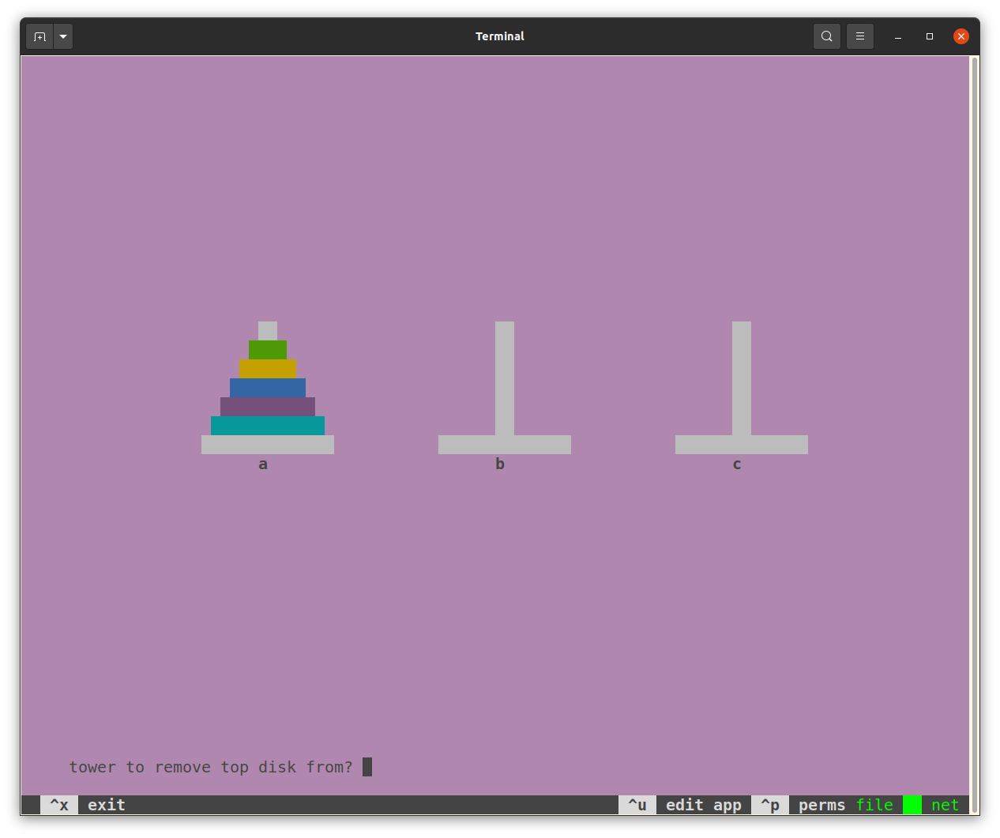

# Teliva - an environment for end-user programming

> &ldquo;Enable all people to modify the software they use in the course of using it.&rdquo;
> &mdash; https://futureofcoding.org/episodes/033.html

> &ldquo;What if we, and all computer users, could reach in and modify our favorite apps?&rdquo;
> &mdash; https://www.inkandswitch.com/end-user-programming

> &ldquo;Software must be as easy to change as it is to use.&rdquo;
> &mdash; https://malleable.systems

## What's this, then?

An extremely naïve, [brutalist](https://en.wikipedia.org/wiki/Brutalist_architecture)
attempt at packaging up simple [Lua](http://www.lua.org) ([5.1](https://www.lua.org/manual/5.1))
apps with almost all the stuff needed to edit and build them. You will need
some Unix-like platform[1] with a C compiler and the ncurses and openssl libraries.

Here's how you run one of the example apps (the [Tower of Hanoi](https://en.wikipedia.org/wiki/Tower_of_Hanoi)):

```
git clone https://github.com/akkartik/teliva
cd teliva
make linux
src/teliva hanoi.tlv
```



No matter what app you run, you are always guaranteed access to a single
obvious, consistent way (currently the hotkey `ctrl-e`) to edit its sources.
And to run the updates after editing.

[1] Tested so far on Linux and Mac OSX; should also work on BSD, WSL on
Windows, etc.

## Isn't this just an IDE?

There's one big difference: these apps are not intended to be runnable outside
of the Teliva environment. Editing the sources will always be a core feature
that's front and center in the UI.

A second, more subtle difference: it's primarily an environment for _running_
apps, and only secondarily for editing them. Starting up the environment puts
you in a running app by default. Creating an app from a clean slate is a
low-priority use case, as is lots of specialized support for developing
complex apps. The sweet spot for Teliva is simple apps that people will want
to edit after using for a while.

## Why Lua?

It's reputedly the fastest interpreted language per line of implementation
code.

## Will it run any Lua program?

Not quite. My priority is providing a good experience for newcomers to
comprehend and modify the programs they use. If it's not clear how to provide
that experience for some kinds of Lua programs, I'd rather disable support for
them in Teliva and let people use regular Lua. Or other platforms!

- This approach doesn't make sense for batch programs, I think. I also don't
  yet have a good story for building server programs in this way.

- I don't know how to obtain a simple, shallow graphics stack, so there's no
  support for graphics at the moment.

- Teliva initializes the ncurses library by default, so apps should assume
  they have access to a text-mode window for printing text to, and a keyboard
  for reading unbuffered keystrokes from.

- I want to provide sandboxed access to system resources (file system,
  network, etc.) which will likely create incompatibilities with the standard
  library. I'm disinclined to try to &lsquo;improve&rsquo; on Lua syntax,
  however. It's not my favorite, but it's good enough.

Teliva is not tested much at all yet. This is my first time programming either
in Lua or within Lua. So bug reports are most appreciated if Lua programs
behave unexpectedly under Teliva.

## Will it run any ncurses program?

Hopefully. ncurses is extremely portable; I don't test on all the
configurations ncurses runs on. In particular, I assume terminals with colors
and UTF-8 support.

## Will it run any Lua [lcurses](https://github.com/lcurses/lcurses) program?

Some functions in lcurses have [additional smarts](https://github.com/lcurses/lcurses/blob/master/lib/curses.lua).
Teliva is consistent with the underlying ncurses.

## What's with the name?

Teliva is the Tamil root for &lsquo;clear&rsquo;. Very much aspirational.

## Coda

In addition to Lua 1.5, Teliva forks or depends on:

* The [ncurses](https://tldp.org/HOWTO/NCURSES-Programming-HOWTO) library for
  building text-mode user interfaces. ([Alternative documentation](https://tldp.org/LDP/lpg-0.4.pdf))
* The [lcurses](https://github.com/lcurses/lcurses) binding for ncurses.
  ([Documentation](http://lcurses.github.io/lcurses))
* The [Kilo](https://github.com/antirez/kilo) text editor. (Read more about it
  in this [fantastic walk-through](https://viewsourcecode.org/snaptoken/kilo).)
* The [luasocket](https://w3.impa.br/~diego/software/luasocket) library of
  networking primitives.
* The [json.lua](https://github.com/rxi/json.lua) library for
  serializing/deserializing to JSON.

Send all praise to them, brickbats to [me](http://akkartik.name/contact).
