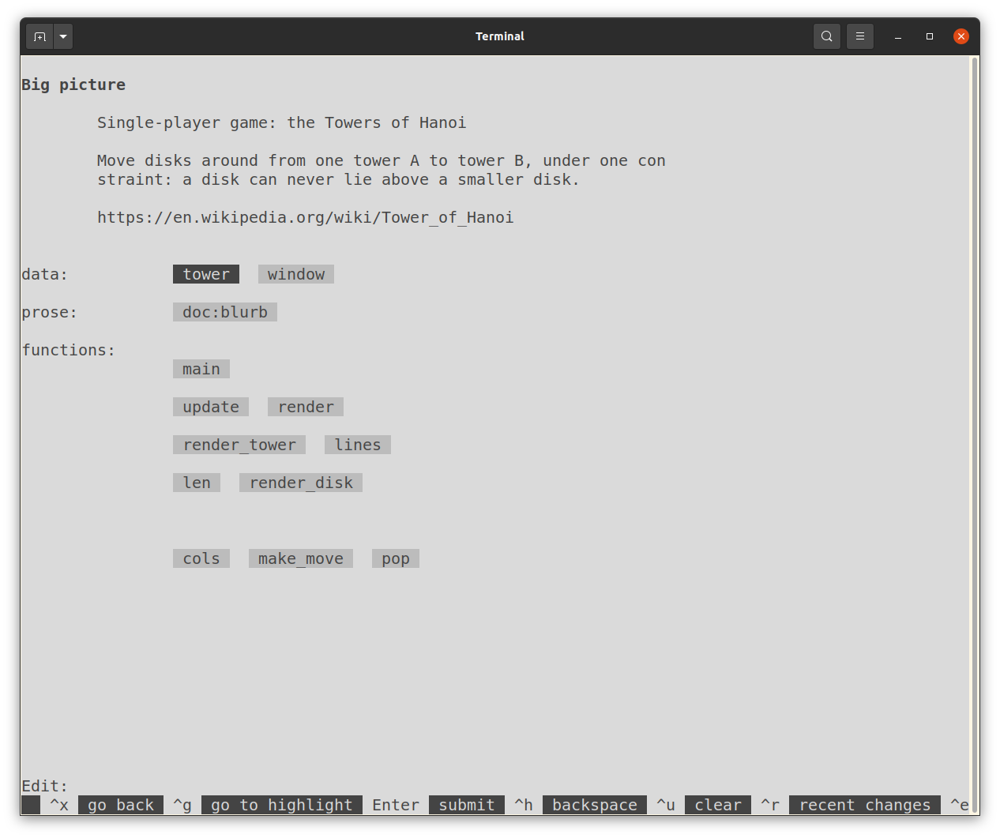

# Teliva - an environment for end-user programming

> &ldquo;Enable all people to modify the software they use in the course of using it.&rdquo;
> &mdash; https://futureofcoding.org/episodes/033.html

> &ldquo;What if we, and all computer users, could reach in and modify our favorite apps?&rdquo;
> &mdash; https://www.inkandswitch.com/end-user-programming

> &ldquo;Software must be as easy to change as it is to use.&rdquo;
> &mdash; https://malleable.systems

## What's this, then?

An extremely naïve, [brutalist](https://en.wikipedia.org/wiki/Brutalist_architecture)
environment for little text-mode [Lua](http://www.lua.org) apps that are easy
to modify.

Here's how you run one of the example apps (the [Tower of Hanoi](https://en.wikipedia.org/wiki/Tower_of_Hanoi)):

```sh
git clone https://github.com/akkartik/teliva
cd teliva
make linux  # replace with 'macosx' or 'bsd' depending on your OS
src/teliva hanoi.tlv
```


No matter what app you run, you are always guaranteed access to a single
obvious, consistent way (currently the hotkey `ctrl-e`) to inspect its
sources.

When you look under the hood of an app, the first thing you see is a
_big-picture view_ which shows the app's major data structures and a top-down
view of the app's code.



Select a definition, make a change, hit `ctrl-e` again, and the app will run
with your updates. ([video](https://archive.org/details/akkartik-2021-11-14))

You will need some Unix-like platform with a C compiler and the ncurses and
openssl libraries. Some possible commands to install them, depending on your
OS and package manager of choice:

* `guix shell -D lua openssl -- make linux`
* `nix-shell --pure` (from a directory containing shell.nix in this repo)
* `sudo apt install libncursesw6-dev openssl`
* `brew install ncurses openssl`

So far I've tested Teliva on Linux, Mac OS X and OpenBSD; it should also work
on other flavors of BSD, WSL on Windows, etc. with only minor modifications.

## Isn't this just an IDE?

There's one big difference: these apps are not intended to be runnable outside
of the Teliva environment. Editing the sources will always be a core feature
that's front and center in the UI.

A second, more subtle difference: it's primarily an environment for _running_
apps, and only secondarily for editing them. Starting up the environment puts
you in a running app by default. Creating an app from a clean slate is a
low-priority use case, as is lots of specialized support for developing
complex apps. The sweet spot for Teliva is simple apps that people will want
to edit after using for a while.

## Why Lua?

It's reputedly the fastest interpreted language per line of implementation
code.

## Will it run any Lua program?

Not quite. My priority is providing a good experience for newcomers to
comprehend and modify the programs they use. If it's not clear how to provide
that experience for some kinds of Lua programs, I'd rather disable support for
them in Teliva and let people use regular Lua. Or other platforms!

- This approach doesn't make sense for batch programs, I think. I also don't
  yet have a good story for building server programs in this way.

- I don't know how to obtain a simple, shallow graphics stack, so there's no
  support for graphics at the moment.

- Teliva initializes the ncurses library by default, so apps should assume
  they have access to a (color, UTF-8) text-mode window for printing text to,
  and a keyboard for reading unbuffered keystrokes from.

- Teliva doesn't use files for source code, so the `require` keyword no longer
  makes sense. You get some libraries preloaded (see below). Beyond those,
  apps should include all Lua code they want to use.

- I want to provide sandboxed access to system resources (file system,
  network, etc.) which will likely create incompatibilities with the standard
  library. I'm disinclined to try to &lsquo;improve&rsquo; on Lua syntax,
  however. It's not my favorite, but it's good enough.

- To create a well-behaved sandbox, Teliva doesn't support adding libraries
  with C bindings beyond the few it starts up with.

- Functions that start with `test_` are special. They're considered automated
  tests and called without arguments every time an app starts up.

- The function `main` is special. It runs every time an app starts up, if all
  its automated tests pass.

Teliva is not tested much at all yet. This is my first time programming either
in Lua or within Lua. So bug reports are most appreciated if Lua programs
behave unexpectedly under Teliva.

## What's included?

* [Lua 5.1](https://www.lua.org/manual/5.1)
* The [ncurses](https://tldp.org/HOWTO/NCURSES-Programming-HOWTO) library for
  building text-mode user interfaces. ([Alternative documentation](https://tldp.org/LDP/lpg-0.4.pdf))
* The [Kilo](https://github.com/antirez/kilo) text editor, modified to use
  ncurses. (Read more about it in this [fantastic walk-through](https://viewsourcecode.org/snaptoken/kilo).)
* The [lcurses](https://github.com/lcurses/lcurses) binding for ncurses (as
  module `curses`).
* The [luasocket](https://w3.impa.br/~diego/software/luasocket) library of
  networking primitives (modules `socket`, `http`, `url`, `headers`, `mime`,
  `ltn12`).
* The [luasec](https://github.com/brunoos/luasec) library for HTTPS support
  (modules `https` and `ssl`).
* The [json.lua](https://github.com/rxi/json.lua) library for
  serializing/deserializing to JSON (module `json`).

The modules mentioned above are always available, just like standard Lua 5.1
libraries. They're available in their entirety with one exception:

* Some functions in lcurses have [additional smarts](https://github.com/lcurses/lcurses/blob/master/lib/curses.lua).
  Teliva is [consistent with the underlying ncurses](https://github.com/akkartik/teliva/blob/main/src/lcurses/curses.lua).

While most things in these modules are currently available, I expect to delete
capabilities throughout this stack as I discover features that don't fit well
with the Teliva experience. If you find Teliva of use, please [introduce yourself](http://akkartik.name/contact)
to me so that I am aware of your use cases. Anybody who is interested can gain
a say in its future direction.

## Known issues

* Colors are currently hardcoded. You get a light background even if your
  terminal started out dark. To tweak colors, look for calls to
  `assume_default_colors()` and `init_pair()`, either in .tlv files for a
  specific app, or in the C sources for the standard code browser/editor.

* Backspace is known to not work in some configurations. As a workaround,
  typing `ctrl-h` tends to work in those situations.

* Keys outside the main keyboard area are mostly not supported. This includes
  the delete key when it's set away from the main keyboard area. (Macs call
  the backspace key &ldquo;delete&rdquo;; it should behave like backspace. As
  a consequence the menu sometimes mentions keys that don't work, just to
  encourage people to try options.)

## What's with the name?

Teliva is the Tamil root for &lsquo;clear&rsquo;. Very much aspirational.

## Other apps to try out

* Conway's Game of Life, as an example of an animated local app.
  ```
  src/teliva life.tlv
  ```

  [video](https://merveilles.town/@akkartik/107277755421024772)

* A viewer for [LiChess TV](https://lichess.org/tv), as an example of
  animation and accessing a remote API over a network.
  ```
  src/teliva chesstv.tlv
  ```

  [video](https://merveilles.town/@akkartik/107319684018301051)

* A browser for the [Gemini protocol](https://gemini.circumlunar.space).
  ```
  src/teliva gemini.tlv
  ```

  [video](https://merveilles.town/@akkartik/107489728557201145)

## Feedback

[Most appreciated.](http://akkartik.name/contact)
